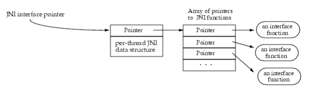
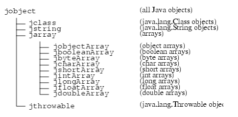

## 学习JNI记录
### 第一章
Java Native Interface(JNI)是Java原生程序接口，用于在JVM上的Java代码和其他语言的代码（例如c、c++、汇编）进行交互。  
#### JNI概览
在用Java编程时有些情况纯Java应用可能不满足需求，所以引入JNI来处理这些情况。  
1. 使用JNI的时机：  
   * 应用中需要Java基础库不支持的平台相关功能时。  
   * 已经有其他语言实现的算法或者功能，需要在Java中使用时。  
   * 需要通过底层语言，例如机器码，来实现一部分时间要求较高的代码时。  
2. 通过JNI编程时，可以用原生方法来：  
   * 创建、检测、更新Java对象。  
   * 调用Java方法。  
   * 捕获和抛出异常。  
   * 加载类、获取类信息。  
   * 执行运行时类型检测。   
   
可以用JNI和调用API结合，让原生应用嵌入到JVM中，这样Java层就不用通过链接VM来调用原生代码，而是通过JNI的API来调用原生代码。  
#### JNI出现的背景和来源
不同提供商的VM有不同的原生接口，这些不同的接口让程序员要在不同平台生产和维护不同版本的代码。很麻烦。  
本想使用一个已存在的方法来作为基础接口，因为这样对需要学多种VM接口的程序员负担最小。  
但是通过研究，Netscape的JRI、Microsoft的RNI和COM都不适合，所以就有了JNI。  
#### JNI要实现的目标
提供设计好的统一接口来支持：  
   * 每个VM提供商可以支持大量源码。  
   * 工具构建不需要再维护不同的原生接口。  
   * 应用开发者可以只写一个版本的原生代码就能运行到不同的VM上。  
实现基础原生方法接口的最佳方法是囊括所有JVM相关的部分，所以通过讨论形成了一套Java设计规范下的统一原生接口，通过讨论明晰了基础原生方法接口适用于以下几点：  
   * 兼容二进制 - 主要原因是原生方法接口的二进制兼容性可以访问所有给定平台的JVM实现方法，程序员就可以在不同平台情况下只维护一份原生方法库。  
   * 效率 - 为了支持时间精确度高的代码，原生方法接口必须只有很小的开销，所有支持VM分离的的技术都要有确定的开销，我们需要在效率和VM分离之间达到一种平衡。  
   * 功能性 - 接口必须暴漏出足够的JVM内部结构，用于原生方法完成有用的任务。  
### 第二章
本章讨论设计JNI主要的问题，多数问题都与原生方法有关。  
#### JNI接口方法和指针
原生方法通过调用JNI接口来访问JVM内容，JNI方法通过一个接口指针来调用，接口指针指向一个指针（P代指这个指针），P指向一个指针列表（AP代指这个指针列表），AP中每个指针指向一个接口方法，列表中每个接口方法对应一个预定义的偏移位置。  
     
    
JNI接口组织结构像c++虚拟方法表或是COM接口一样，这种结构较于直接调用方法的优势是JNI头文件可以于原生代码分离，一个VM可以轻松提供多个版本的JNI头文件，比如一个VM支持两种JNI方法表：  
   * 一种进行所有非法参数检测用于调试。  
   * 一种基于JNI语法最少的参数检测（更高效）用于发布。  
JNI接口指针只在当前线程有效，因此原生方法不能把接口指针传到其他线程中。实现了JNI的VM可能会通过JNI的指针接口在指针指向的地方收集和存储本地线程数据。  
原生方法接收JNI接口指针作为参数。VM需要保证在同一线程下多次调用原生方法时，传入相同的JNI接口指针。然而原生方法可以在不同线程中被调用，因此可能会收到不同的JNI接口指针。  
#### 加载和链接原生方法
原生方法通过System.loadLibrary方法来加载，下面的例子中，类初始化方法加载了特定平台的定义了f方法的原生库：  
```
   package pkg;  
      class Cls {  
         native double f(int i, String s);   
            static {   
               System.loadLibrary(“pkg_Cls”);   
            }   
   }
```  
System.loadLibrary传入的参数是随意选的库名称，系统根据平台特定的基础步骤去把库名转换为原生库名。比如Solaris系统把pkg_Cls转换为libpkg_Cls.so，Win32系统把pkg_Cls转换为pkg_Cls.dll。  
开发者可以使用单一库的同一个类加载器去加载多个类的原生方法，VM内部每个类加载器维护一个加载原生库的列表，供应商需要减少类名冲突选择合适的类名。  
如果底层操作系统不支持动态链接，所有原生方法需要预链接到VM中，这种情况下，VM无需真正加载库就可以完成System.loadLibrary调用。  
开发者也可以调用JNI方法RegisterNatives()来注册相关类的原生方法，RegisterNatives()方法对于静态链接方法特别有用。  
#### 原生方法命名
动态链接是基于命名来解析的，原生方法命名包括以下几点：  
   * 前缀Java_。  
   * 任意类名的全称。  
   * 下划线("_")。  
   * 任意方法名。  
   * 重载的原生方法的参数签名后面需要两个下划线("__")。  
VM通过方法名匹配原生库中的方法，VM首先匹配短命名（命名不带参数签名），然后匹配长名称（带参数签名），开发者只用在原生方法重载其他原生方法时才需要用长命名。  
原生方法于非原生方法名称一样是没有问题的，非原生方法（Java方法）不存在于原生库中。  
下面的列子中，原生方法g没有被长命名链接，因为存在另一个不在原生库中的非原生方法g。  
```
    class Cls1 {  
        int g(int i);  
        native int g(double d);  
    }  
```
采用简单的名称修饰方案来确保所有Unicode字符全部转换为有效的c的方法名称。在完整类名中使用下划线("_")字符代替斜杠("/")，用_0..._9来做转译序列：  
| 转译序列  |  含义  |   
| :----: | :----: |
| _0XXXX  |  Unicode字符XXXX(小写表示非ASCII)  |   
| _1  |  字符"_"  |   
| _2  |  字符";"  |   
| _3  |  字符"["  |   
原生方法和接口API都遵从相应平台的基础库调用框架，比如，UNIX系统使用c调用框架，Win32系统使用stdcall调用框架。  
#### 原生方法参数
JNI接口指针是原生方法的首要参数，JNI接口指针的类型是JNIEnv，第二个参数根据方法是是否为静态方法，分为两类，静态方法时该参数是对Java类的引用，非静态方法时是对对象的引用。  
其余的参数对应Java的方法参数，原生方法通过返回值向调用例程返回结果，下面是相应例子：  
   * Java方法  
   ```
        package pkg;  
        class Cls {  
             native double f(int i, String s);   
             ...   
        }
   ```
   * 相应的c方法   
   ```
        jdouble Java_pkg_Cls_f__ILjava_lang_String_2 (   
             JNIEnv *env,        /* 接口指针（常用作操作Java对象） */    
             jobject obj,        /* "this"指针 */    
             jint i,             /* 参数#1 */    
             jstring s)          /* 参数#2 */    
        {   
             /* 通过Java字符串，复制获取c字符串 */    
             const char *str = (*env)->GetStringUTFChars(env, s, 0);    
             /* 处理字符串 */    
             ...    
             /* 处理结束 */    
             (*env)->ReleaseStringUTFChars(env, s, str);    
             return ...    
        }    
   ```
   * 相应的c++方法（使用c++方法更直观）   
   ```
        extern "C" /* 指定使用c的调用架构 */   
        jdouble Java_pkg_Cls_f__ILjava_lang_String_2 (   
            JNIEnv *env,        /* 接口指针（常用作操作Java对象） */   
            jobject obj,        /* "this"指针 */   
            jint i,             /* 参数#1 */   
            jstring s)          /* 参数#2 */   
        {   
             const char *str = env->GetStringUTFChars(s, 0);    
             ...    
             env->ReleaseStringUTFChars(s, str);    
             return ...    
        } 
   ```   
使用c++时无需额外的间接层和接口指针参数，但是底层机制与c是一样的。在c++中，JNI接口被定义为可拓展为c的内联成员方法。   
#### 引用Java对象
整数类型、字符类型等这类的基础类型，在Java和原生代码中可以互相拷贝，但是任意Java对象是通过传入引用来实现的。   
VM必须保持记录所有已传入原生代码的对象，这样才能保证它们不会被垃圾回收机制回收掉。   
另一方面，原生代码需要一种方式告知VM不再需要这些对象。此外，垃圾回收机制必须可以回收掉原生代码引用的对象。   
#### 本地引用和全局引用
JNI通过两种标签区分对象的引用：本地引用和全局引用。本地引用只在调用的原生方法中有效，在方法结束时自动释放。全局引用在主动释放之前一直有效。   
对象作为本地引用传入原生方法，所有JNI返回的都是Java本地引用对象。JNI允许开发者通过本地引用创建全局引用，需要Java对象的JNI方法可以接收本地引用和全局引用。原生方法可能向VM返回本地或者全局引用作为结果。   
多数情况下，开发者应该在原生方法结束后依赖VM来回收所有的本地引用，然而，有些情况需要主动释放本地引用：   
   * 原生方法访问一个大的Java对象并创建了一个对应的本地引用，原生方法在返回调用之前执行了一些额外操作，即使这个大的Java对象在其余操作中并没有使用其引用也不会被自动回收。   
   * 原生方法创建了大量的本地引用，即使它们不是同时被使用，VM仍需要一定量的空间来记录本地引用，创建太多的本地引用可能会导致系统OOM。比如原生方法循环遍历一个大的对象列表，检索元素作为本地引用，然后每次遍历操作一个元素，下次遍历时，程序就不再需要这个元素的引用了。   
JNI允许开发者在任何地方手动通过一个原生方法回收本地引用。为了确保开发者能手动回收本地引用，JNI方法不允许创建除了作为返回值意外的本地引用。   
本地引用只在它们被创建的线程里有效，原生代码不能从一个线程里传本地到另一个线程里。   
#### 实施本地引用
为了实施本地引用，JVM为每个Java到原生方法的转换和控制都创建了个注册器，该注册器记录了不可变的本地引用和对应的Java对象，让对象可以不被垃圾回收。所有传入原生方法的对象（包括返回JNI方法结果的对象）都自动被加到注册器中。注册器在原生方法返回后被删除，之后允许其所有的内容被垃圾回收。   
有不同的方法来实施注册器，例如使用表、链表或哈希表。即使引用的记录应避免重复，注册器并没有义务检测重复的内容。   
值得注意的是，本地引用的实施不能简单通过扫描原生栈的方法来检测，原生代码可能把本地引用存到全局引用或者堆结构中去。   
#### 访问Java对象
JNI提供了大量的访问全局和本地引用的方法，这意味着同样的原生方法不管Java内部如何实现都有用，这就是JNI支持大量的VM实现的主要原因。   
通过不透明引用的访问方法开销高于直接使用c数据结构的开销，大多数情况下，Java开发者使用原生方法执行重要任务时可以掩盖这些接口开销。   
#### 访问基础列表
Java对象包含大量基础数据类型（例如整数和字符串）的开销是无法接受的。遍历Java列表并通过方法调用检索每个元素的效率非常低（较于原生方法的向量和矩阵计算）。   
一种解决方法引入了“固定”的概念，原生方法可以让VM固定列表的内容，原生方法接收到一个直接指向元素的指针这种方法有两个影响：   
   * 垃圾回收机制需要支持固定操作。   
   * VM必须持续在内存中存贮基础列表，即使这种方式是对大多数基础列表来说最自然的实现方式，布尔列表仍使用打包和解包的方法来实现，因此依赖于多余的布尔列表空间的原生代码很不方便。   
所以选择一种折中方法来处理上面这些问题。   
首先，提供一系列方法用于把Java列表片段拷贝到原生内存缓存中去。如果原生方法在大的列表中仅需要访问很少的元素时我们就用这些方法。   
然后，开发者可以使用其他的一些方法检索固定版本的列表元素，需要记住这些方法可能需要JVM执行数据分配和拷贝操作。这些方法是否真的拷贝了列表取决于VM的实现，例如：   
   * 如果垃圾回收支持固定，列表所需空间与原生方法预期大小一致，就不需要拷贝。   
   * 不然，列表必然会被按固定格式格式拷贝到不可变内存块（比如c的堆），布尔列表会以打包和解包的方法实现，返回一个指向拷贝的指针。   
最后，接口提供方法告知VM原生代码不再需要访问数组元素，当调用到这些方法系统会解除列表固定或者调和源列表和其拷贝然后回收其拷贝。   
这些步骤非常灵活，垃圾回收机制可以在固定和访问列表元素之间分离决策，比如：垃圾回收可以拷贝小的对象，固定大的对象。   
JNI实现必须确保运行在多线程上的原生方法可以同时访问同一个列表，比如：JNI可以对每个固定列表保存一个内部计数器，这样一个线程未解除固定则其他线程也会被固定，注意，JNI不需要对原生方法的单独访问锁住默认列表，从不同线程同时更新Java列表会导致不可预期的结果。   
#### 访问字段和方法
JNI允许原生代码访问字段并调用Java对象的方法，JNI通过符号名称和类型签名来识别方法，一个两步的过程指出通过名称和签名来定位方法的消耗：   
   * 调用cls类中的方法f，原生代码会先获取方法ID：   
        jmethodID mid = env->GetMethodID(cls, “f”, “(ILjava/lang/String;)D”);    
   * 然后原生方法不需要再查找就能重复使用方法ID：   
        jdouble result = env->CallDoubleMethod(obj, mid, 10, str);    
字段或者方法ID不会阻止VM卸载派生该ID的类，类被卸载后，方法和字段ID都无效了，因此如果要长时间使用一个方法或者字段ID时，原生代码需要保持实时引用底层类，或者重新计算方法和字段ID。   
JNI对字段和方法的内部实现没有施加任何限制。   
#### 报告程序错误
JNI不检查空指针或者非法参数类型之类的程序错误，非法参数类型包括使用普通的Java对象而不是类对象等，JNI不检查这些程序错误有以下几个原因：   
   * 强制JNI方法检查所有可能的错误情况会降低正常原生方法的表现。   
   * 一些情况下，没有足够的运行时类型信息去执行检测。   
大多数c库方法不防备程序错误，比如printf()方法在收到一个非法地址时经常造成运行时错误，而不是返回一个错误码，强制c库方法检测所有可能的错误情况会导致这种检测在用户代码和库里重复。   
开发者必不能传入JNI方法的非法指针或者错误类型的参数，这样做会导致任意后果，包括错误系统状态或者VM崩溃。   
#### Java异常
JNI允许原生方法提出任意Java异常，原生代码也能处理独立的Java异常，未处理的Java异常会传回到VM。   
#### 异常和错误码
某些JNI方法使用Java的异常机制报告错误情况。大多数情况下，JNI方法通过返回错误码同时抛出Java异常来报告错误情况。错误码是个在正常返回值范围之外的特殊返回值（例如NULL）。因此开发者可以：   
   * 快速检查返回值来判断JNI调用是否有问题。   
   * 调用ExceptionOccurred()方法去获取包含更多错误详情的异常对象。   
有两种情况，开发者即使不能先检测错误码也要检测异常情况：   
   * JNI方法调用Java方法并返回该Java方法的结果，开发者必须调用ExceptionOccurred()来检查Java方法执行时可能出现的异常。   
   * 一些JNI列表访问方法不返回错误码，但是可能抛出ArrayIndexOutOfBoundsException或ArrayStoreException异常。   
其他情况下，正确的返回值可以保证没有抛出过异常。   
#### 异步异常
一些多线程情况下，不是当前线程的线程可能会抛出异步异常，异步异常不会影响当前线程原生代码的执行，直到：   
   * 原生代码调用可能抛出同步异常的JNI方法。   
   * 原生代码使用ExceptionOccurred()显示检查同步和异步异常。   
注意只有可能会触发同步异常的JNI方法才会检查异步异常。   
原生方法需要在必要的地方（例如没有其他检查的紧密循环中）插入ExceptionOccurred()检查来确保当前线程及时响应异步异常。   
#### 异常处理
原生代码中有两种方法处理异常：   
   * 原生方法可以选择立即返回，在发起调用原生方法的Java代码中抛出异常   
   * 原生代码可以通过调用ExceptionClear()清除异常并自己的异常处理代码   
一个异常出现后，原生代码必须首先清除异常才能继续调用其他JNI。当有一个待处理的异常时，JNI可以安全调用的方法是：   
    ExceptionOccurred()   
    ExceptionDescribe()   
    ExceptionClear()   
    ExceptionCheck()   
    ReleaseStringChars()   
    ReleaseStringUTFChars()   
    ReleaseStringCritical()   
    Release<Type>ArrayElements()   
    ReleasePrimitiveArrayCritical()   
    DeleteLocalRef()   
    DeleteGlobalRef()   
    DeleteWeakGlobalRef()   
    MonitorExit()   
    PushLocalFrame()   
    PopLocalFrame()   
### 第三章
本章讨论JNI从Java类型到c类型的映射。   
#### 基础类型
下表描述了Java基础类型和其机器相关的原生等效项。
| Java类型  |  原生类型  |  说明  |   
| -------- | -------- | -------- |
| boolean  |  jboolean  |  8位有符号整数  |   
| byte  |  jbyte  |  8位有符号整数  |   
| char  |  jchar  |  16位无符号整数  |   
| short  |  jshort  |  16位有符号整数  |   
| int  |  jint  |  32位有符号整数  |   
| long  |  jlong  |  64位有符号整数  |   
| float  |  jfloat  |  32位浮点数  |   
| double  |  jdouble  |  64位浮点数  |   
| void  |  void  |  N/A  |   

为了方便使用，提供以下定义：   
```
   #define JNI_FALSE  0   
   #define JNI_TRUE   1    
```
jsize整数类型用于描述基数索引和大小：   
```   
   typedef jint jsize;
```
#### 引用类型
JNI包含了大量对应于不同类型Java对象的引用类型，JNI引用类型组织架构如下：   
      

c中，所有其他JNI引用类型都被定义为相同的jobject，例如：  
   * typedef jobject jclass;    

c++中，JNI引入了一系列虚拟类来加强子类之前的关系，例如：  
```
    class _jobject {};   
    class _jclass : public _jobject {};   
    ...   
    typedef _jobject *jobject;   
    typedef _jclass *jclass;   
```
#### 字段和方法ID
方法和字段ID都是经典的c指针类型：   
```
    struct _jfieldID;              /* 不透明结构 */   
    typedef struct _jfieldID *jfieldID;   /* 字段ID */   
    struct _jmethodID;              /* 不透明结构 */   
    typedef struct _jmethodID *jmethodID; /* 方法ID */    
```
#### 类型签名
JNI使用JVM的类型签名来表示，下表展示了这些类型签名：   
| 类型签名 | Java类型 |   
| :---- | :---- | 
| Z | boolean |   
| B | byte |   
| C | char |   
| S | short |   
| I | int |   
| J | long |   
| F | float |   
| D | double |   
| L fully-qualified-class ; | fully-qualified-class |   
| [ type | type[] |   
| ( arg-types ) ret-type | method type |   

例如Java方法：   
```
   long f (int n, String s, int[] arr);  
```  
有如下的类型签名：   
```
   (ILjava/lang/String;[I)J  
```  
#### 修改后的UTF-8字符串
JNI使用修改后的UTF-8字符串来表示各种字符串类型，修改后的UTF-8字符串与JVM中使用的字符串相同，修改后的UTF-8字符串经过被编码，使得字符串序列只包含单字符占1字节的非空ASCII字符，同时又可以表示所有的统一编码字符。   
从\u0001到\u007F范围内的字符通过单字节表示，如下：

| 0    | bits 6-0 |   
| ---- | ---- |

7位数据的字节来给字符赋值。   
空字符（'\u0000'）和'\u0080'到'\u07FF'范围内的字符分别由字节x和字节y来表示：   
   * 字节x：   
        | 1 | 1 | 0 | bits 10-6 |   
        | - | - | - | - |
   * 字节y：   
        | 1 | 0 | bits 5-0 |
        | - | - | - |

以上字节代表字符值为((x & 0x1f) << 6) + (y & 0x3f)。   
'\u0800'到'\uFFFF'范围内的字符由字节x、字节y和字节z来表示：   
   * 字节x：   
        | 1 | 1 | 1 | 0 | bits 15-12 |   
        | - | - | - | - | - |
   * 字节y：   
        | 1 | 0 | bits 11-6 |   
        | - | - | - |
   * 字节z：   
        | 1 | 0 | bits 5-0 |   
        | - | - | - |
以上字节代表字符值为((x & 0xf) << 12) + ((y & 0x3f) << 6) + (z & 0x3f)。   
码位高于U+FFFF的字符（所谓的增补字符）是通过分别使用两个UTF-16代码单元来表示的，这两个UTF-16代码单元分别被编码为两个修改后的UTF-8字符串，由三个字节表示，也就是说增补字符用六个字节表示，分别是u、v、w、x、y和z：   
   * 字节u：   
        | 1 | 1 | 1 | 0 | 1 | 1 | 0 | 1 |   
        | - | - | - | - | - | - | - | - |
   * 字节v：   
        | 1 | 0 | 1 | 0 | (bits 20-16) - 1 |   
        | - | - | - | - | - |
   * 字节w：   
        | 1 | 0 | bits 15-10 |   
        | - | - | - |
   * 字节x：   
        | 1 | 1 | 1 | 0 | 1 | 1 | 0 | 1 | 
        | - | - | - | - | - | - | - | - |  
   * 字节y：   
        | 1 | 0 | 1 | 1 | bits 9-6 |   
        | - | - | - | - | - |
   * 字节z：   
        | 1 | 0 | bits 5-0 |   
        | - | - | - |
以上字节代表字符值为0x10000+((v&0x0f)<<16)+((w&0x3f)<<10)+(y&0x0f)<<6)+(z&0x3f)。   
多字节字符的字节从大到小（先高位字节）的顺序存贮在class文件中。   
这种格式和UTF-8有两种不同点：   
   * 0字符用两字节的格式表示，意味着修改后的UTF-8字符串永远不会嵌入null。   
   * 基础UTF-8只有1字节、2字节或3字节格式，JVM不识别4字节格式的基础UTF-8，而是使用自己的2倍3字节格式。   
### 第四章
本章作为JNI函数参考部分，提供了JNI所有方法的完整列表，也介绍了JNI方法表的抽象层。   
请注意使用“必须”来描述的限制，比如，当你看到特定的JNI方法必须接收一个非空对象，不向方法里传入空对象就是你需要确保的责任，该JNI方法中的实现不需要执行空指针的检测。   
#### 接口方法表
每个方法都在固定的位置，通过JNIEnv参数访问，JNIEnv类型是一个指针指向一个存储了所有JNI方法指针的结构体，JNIEnv定义如下：   
```
   typedef const struct JNINativeInterface *JNIEnv; 
```
VM初始化以下方法表（注意前三个null是兼容COM，第四个null是用作拓展，JNI接口指针共享方法表）：   
    [JNI方法表](JNINativeInterface)
#### 调用API
调用API允许软件提供商加载JVM到一个二进制原生应用中，提供商无需链接JVM源码就可以交付支持Java的应用。   
本章始于调用API的概览，后面是调用API的引用参考。   
### 概览
以下代码例子说明了如何使用调用API中的方法，这个例子中，c++代码创建一个JVM并调用叫Main.test的静态方法，为了清除一下起见，我们去掉了错误检查：
```
    #include <jni.h>       /* 定义区 */   
    ...   
    JavaVM *jvm;       /* 表示JVM */   
    JNIEnv *env;       /* 指向原生方法接口的指针 */   
    JavaVMInitArgs vm_args; /* JDK/JRE 6 VM 初始化参数 */   
    JavaVMOption* options = new JavaVMOption[1];   
    options[0].optionString = "-Djava.class.path=/usr/lib/java";   
    vm_args.version = JNI_VERSION_1_6;   
    vm_args.nOptions = 1;   
    vm_args.options = options;   
    vm_args.ignoreUnrecognized = false;   
    /* 加载并初始化JVM, 在env中返回JNI接口指针 */   
    JNI_CreateJavaVM(&jvm, &env, &vm_args);   
    delete options;   
    /* 使用JNI调用Main.test方法 */   
    jclass cls = env->FindClass("Main");   
    jmethodID mid = env->GetStaticMethodID(cls, "test", "(I)V");   
    env->CallStaticVoidMethod(cls, mid, 100);   
    /* 结束 */   
    jvm->DestroyJavaVM();   
```   
以上例子使用了API中的三个方法，调用API允许原生代码使用JNI接口指针去访问VM资源，这种设计类似于Netscape的JRI嵌入式接口。   
#### 创建JVM
JNI_CreateJavaVM()方法加载并初始化JVM，返回指向JNI接口指针的指针，调用这个方法的线程被认为是主线程。   
#### 依附到VM
JNI接口指针（JNIEnv）只在当前线程有效。其他线程如果需要访问JVM，必须先调用AttachCurrentThread()来依附到VM上从而获取JNI接口指针。一旦依附于VM，原生线程就会像有序的Java线程一样运行在原生方法中。原生线程会保留对VM的依附，直到调用DetachCurrentThread()方法来分离。   
依附后的线程需要足够的栈空间来执行合理的工作量，每个线程分配的栈空间大小是由操作系统指定的，例如使用并行线程，栈空间大小由pthread_create的pthread_attr_t参数来指定。    
#### 从VM分离
依附于VM的原生线程必须在退出前调用DetachCurrentThread()来分离，如果当前线程有Java方法在调用栈中，线程就无法分离。   
#### 卸载VM
JNI_DestroyJavaVM()方法卸载JVM，JDK/JRE 1.1中，只有主线程能够通过调用DestroyJavaVM卸载VM，JDK/JRE 1.2中这个限制被去除了，任何线程都可能调用DestroyJavaVM来卸载VM。   
VM会等到当前线程成为唯一非守护用户进程线程后才会真正卸载，用户线程包括Java线程和依附的原生线程，这个限制是因为Java线程或原生线程可能持有系统资源，比如锁、窗口或其他，VM无法自动释放这些资源。通过限制当前线程为卸载时唯一运行的线程，唯一线程中释放系统持有资源的责任就是开发者的了。   
#### 库和版本控制、调用API方法
版本方法说明具体内容看链接：https://docs.oracle.com/javase/6/docs/technotes/guides/jni/spec/invocation.html